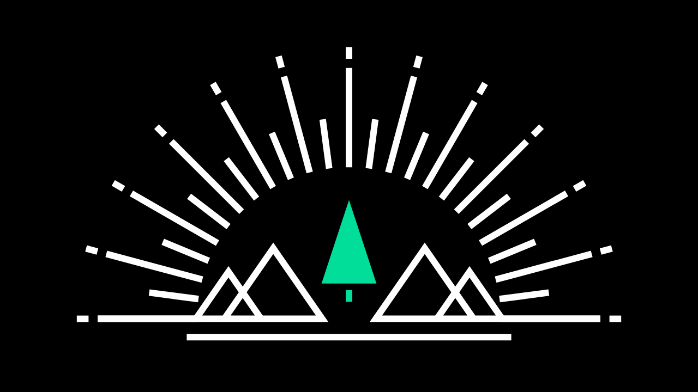

  

# Bon Voyage

### What's up?

A simple directory of travel videos I edited along the years.

### Main Concepts

- Get the most out of Next.js, a simple server-side rendered page leveraging `getInitialProps` to fetch data from Vimeo
- Iterate thanks to Flow with the confidence provided by static typings
- Apply progressive enhancement principles, _all_ the site effects even if JS is disabled (CSS animations & transitions for the win 😍)
- Make sure links are accessible and have a visible focus effect (try moving around with TAB / SHIFT + TAB!)
- Prefetch assets (cursors) via invisible images

### Develop

1. You need a Vimeo access token to allow the app's requests toward the Vimeo API: [learn how to get one](https://developer.vimeo.com/api/guides/start#generate-access-token).
1. Copy/pasta `.env.sample` to `.env` and set your token there.
1. Install dependencies with `yarn`
1. Hack fun with `yarn dev` 🔨
